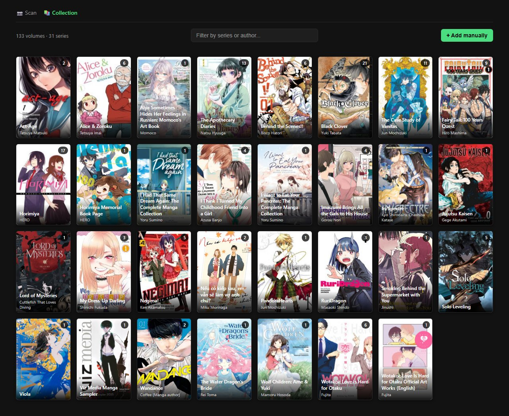
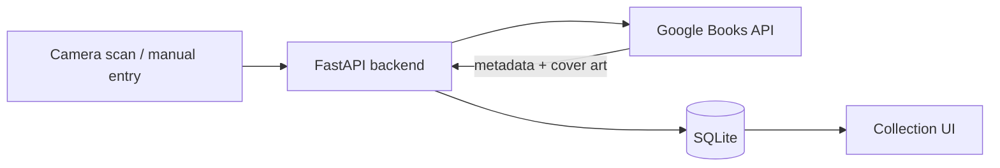
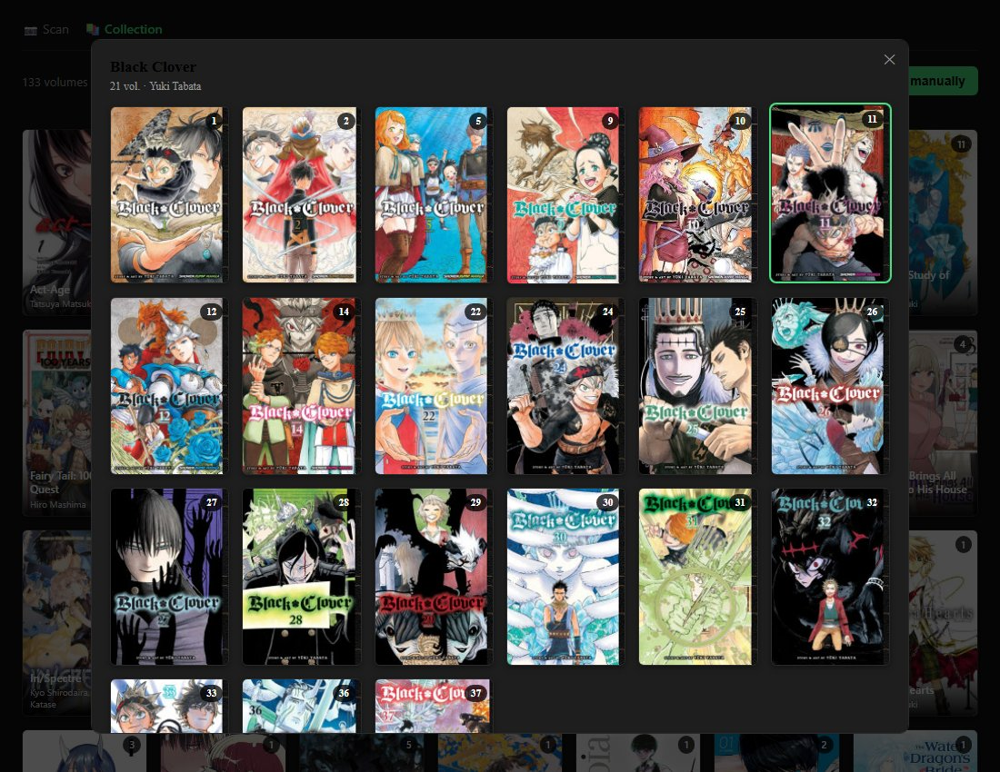
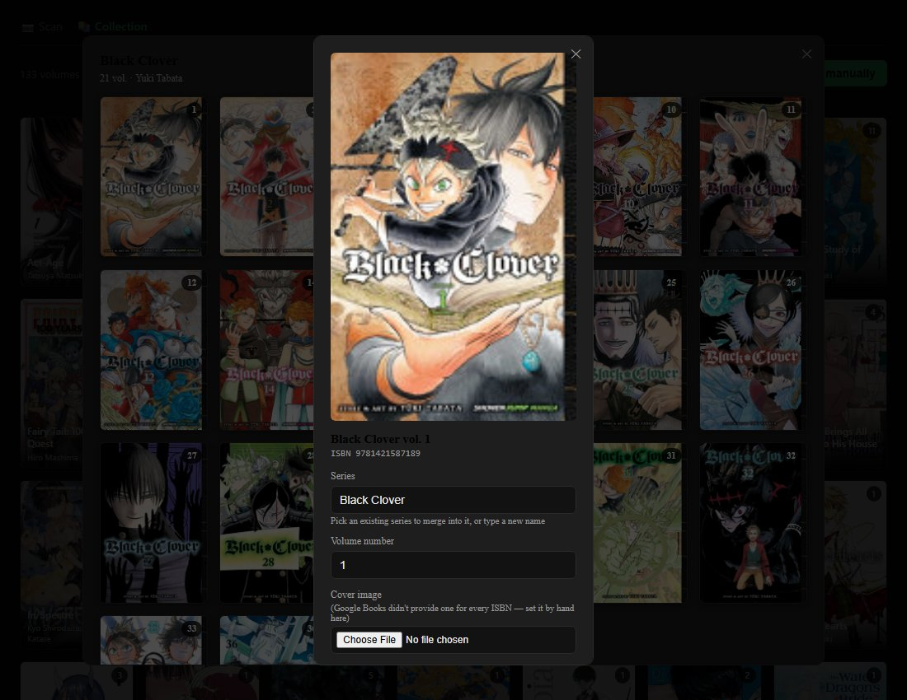

# Manga Collection Tracker

A personal FastAPI backend for tracking a physical manga collection: scan a
barcode to log a volume, browse the result as a cover-art grid.

**133 volumes · 31 series · 194 scans logged · 41 automated tests · GitHub Actions CI**



*The `/collection` page, screenshotted straight from a running instance —
this is my actual collection, not placeholder data.*

## Problem

Tracking a physical manga collection by memory doesn't scale past a
shelf or two: it's easy to forget which volumes you already own and
rebuy one at a bookstore, or lose track of gaps in a series. Spreadsheets
work but require manual entry for every book — title, volume number,
author — which is tedious enough that most people (including me) never
actually keep one up to date. The barcode already on every book solves
the identification problem; this project is about making "scan → done"
actually true, with the metadata and cover art filled in automatically
rather than typed by hand.

## Architecture



`scanner.html` and `collection.html` are served by the same FastAPI app
they call — there's no separate frontend server or build step. Both pages
call the API via `window.location.origin`, so every request is same-origin
whether you're on `localhost`, a LAN IP, or a `cloudflared` tunnel URL (see
[Engineering Decisions](#engineering-decisions) for why that made the
original CORS middleware unnecessary). On a scan, the backend looks up the
ISBN against Google Books, parses the series/volume number out of the
returned title, downloads the cover image if one exists, and writes all of
it to SQLite in one request — the UI then just reads that back.

## Getting Started

```bash
pip install -r requirements.txt
```

Copy `.env.example` to `.env` and fill in `GOOGLE_BOOKS_API_KEY` (free — from
[console.cloud.google.com](https://console.cloud.google.com), enable "Books
API", create an API key). Without it, ISBN lookups run unauthenticated and
will hit Google's near-zero anonymous quota (429s on most requests). `.env`
is gitignored — never commit it.

```bash
python run.py
```

(Equivalent to `python -m uvicorn app.backend.main:app --reload --host
0.0.0.0 --port 8000` — `run.py` just avoids retyping that, and sidesteps
PATH issues on systems where pip installs scripts somewhere your shell
doesn't look.) The database (`manga.db`) is created automatically from
`schema.sql` on first startup. Once running, check
`http://localhost:8000/docs` for the interactive API.

### Trying the barcode scanner on a phone

The backend serves `scanner.html` itself at `/`, so whatever URL reaches
the backend also opens the scanner. Camera access needs a secure context,
though — a plain `http://` LAN link doesn't qualify on any phone browser,
only `https://` or literally `localhost` do. For a real phone test, tunnel
the backend and open the tunnel's `https://` URL instead of the LAN address:

```bash
cloudflared tunnel --url http://localhost:8000
```

No account needed — it prints a random `https://...trycloudflare.com` URL
that proxies straight to your local server, and camera access works from
it. `run.py` prints this exact command on every startup as a reminder.
(ngrok is the more commonly recommended alternative, but in practice its
free accounts now require a newer agent version than package managers tend
to ship, and its self-updater got flagged and deleted by Windows Defender
in testing — cloudflared avoided both problems and needs no signup at all.)

## Implementation

### How a scan works

1. Scan a barcode → `POST /scan/isbn` → looks up Google Books, creates
   the series/volume if new, tells you if you already own it
2. Confirm the result ("✓ Yes, that's it" / "✗ Wrong manga") — a barcode
   misread can point at the wrong ISBN, so nothing is trusted until you
   confirm it. "Wrong manga" calls `DELETE /volumes/{id}` to undo the
   volume this same scan just created, but only if this scan is what
   created it — a pre-existing library entry is never touched.
3. If Google Books had a cover image for that ISBN, it's downloaded,
   **validated as a genuine image** (see [Engineering
   Decisions](#engineering-decisions)), and attached automatically as
   part of step 1. If it didn't, the volume is still added, just without one.
4. Browse the result at `/collection` — a cover-art grid, grouped by
   series. Click a series to see its volumes:

   

   then click a volume to fix its number, move it to a different series,
   attach a cover by hand, or remove it:

   

5. No barcode to scan at all? "+ Add manually" on `/collection` adds a
   volume directly (`POST /volumes`) — series, volume number, author, and
   ISBN are all optional except the series name.

Every `/scan/isbn` call that resolves to a volume (new or already owned)
also appends one JSON line to `scan_log.jsonl` — a plain-text, timestamped
record of everything scanned, in order. It's a log, not the source of
truth (that's `manga.db`); a failed lookup writes nothing, since nothing
happened yet.

### API routes

| Method | Path                          | Purpose                                              |
|--------|-------------------------------|-------------------------------------------------------|
| POST   | `/scan/isbn`                  | Look up/register a volume from a scanned ISBN, auto-fetching its cover |
| POST   | `/volumes`                    | Add a volume by hand — no barcode/lookup involved      |
| DELETE | `/volumes/{id}`               | Remove a volume (undo a scan, or a deliberate removal from `/collection`) |
| PATCH  | `/volumes/{id}`                | Correct a volume's number, or move it to a different series |
| POST   | `/volumes/{id}/cover`         | Manually attach a cover image                          |
| GET    | `/library`                    | Full collection, grouped by series                     |
| GET    | `/series`                     | List all series                                        |
| GET    | `/series/{series_id}/volumes` | Volumes belonging to one series                         |
| GET    | `/collection`                 | The cover-art grid browser page                          |

### Project structure

```
Manga Library/
├── run.py                  entry point — start with `python run.py`
├── requirements.txt
├── .env.example            template for GOOGLE_BOOKS_API_KEY; copy to .env
├── ruff.toml                lint/format config
├── app/                     all source code (a Python package)
│   ├── backend/              FastAPI app (a Python package)
│   │   ├── main.py            app setup + routes (wiring only)
│   │   ├── models.py           Pydantic request/response schemas
│   │   ├── covers.py            cover storage, validation, Google Books fetch
│   │   ├── titles.py             title → (series, volume number) parsing
│   │   ├── db.py                 SQLite data access layer
│   │   └── schema.sql             database schema (series, volumes)
│   └── frontend/              static pages, served by the backend
│       ├── scanner.html         barcode scanner + confirm UI, served at "/"
│       └── collection.html      cover-art grid browser, served at "/collection"
├── tests/                   pytest suite — see Testing below
└── (gitignored runtime data, created automatically — see below)
```

`app/` holds only source code; `run.py` imports it as `app.backend.main:app`.
Runtime data lives at the project root instead of inside `app/`, so it stays
put and easy to find regardless of how the source is organized internally.

Gitignored runtime data (created automatically, never committed):
`.env`, `manga.db`, `scan_log.jsonl`, `covers/`

## Testing

```bash
python -m pytest -q
```

41 tests: title parsing (the tricky Google Books title formats documented
in `titles.py`'s own comments), the `db.py` data-access layer (series
dedup, volume CRUD, series reassignment, a database-level race-condition
fix), cover upload validation (oversized files, non-image bytes, correct
format detection), and every API route through FastAPI's `TestClient`.
Google Books calls are faked in the API tests rather than hit for real, so
the suite is deterministic and doesn't burn API quota. Every test runs
against a throwaway SQLite file and covers directory — never `manga.db` or
`covers/`, which hold my actual collection.

CI (GitHub Actions) runs `ruff check`, `ruff format --check`, and the full
test suite on every push and pull request.

## Results

Numbers from my own collection as of this writing, pulled directly from
`manga.db`/`scan_log.jsonl` (same data the screenshot above shows):

- 133 volumes tracked across 31 series
- 126 of those volumes (95%) have a cover image attached automatically
  from Google Books
- 194 scan events logged since I started using it
- 41 automated tests, all passing in CI

This isn't a security audit or a certification — but the codebase does
follow a few specific defensive practices worth naming rather than just
claiming "secure": every database query is parameterized (no string-built
SQL), user-supplied text is HTML-escaped before insertion into the DOM
on the frontend, cover images are validated by actually decoding them
(not trusted by filename or client-supplied `Content-Type`) and capped at
10MB, and saved files get server-generated UUID names rather than
anything derived from user input.

## Engineering Decisions

**Cutting the camera-based cover-matching pipeline.** The cover-art
feature originally worked by taking a photo with a phone camera, then
using OpenCV to rectify/deskew the shot and CLIP + FAISS to match it
against a reference image index and identify the book. That pipeline
worked, but it added a camera-calibration step, a vector index to keep in
sync, and a failure mode ("no confident match") for every single scan —
for a problem barcode scanning already solves outright once Google Books
is doing the metadata lookup anyway. It was cut once the barcode + Google
Books flow made it redundant; `schema.sql` still carries the now-unused
`embedding_id` column rather than risk an `ALTER TABLE` on a database
with real data in it.

**Removing CORS middleware entirely, not narrowing it.** The backend used
to run `CORSMiddleware` with `allow_origins=["*"]`, left over from
treating the frontend as a separate origin during early development.
Since `scanner.html`/`collection.html` are served by this same app and
call the API via `window.location.origin`, every request — on localhost,
a LAN IP, or the cloudflared tunnel — is actually same-origin. The
middleware wasn't protecting anything; removing it was more correct than
tightening its origin list would have been.

**Fixing the series-dedup race condition at the database level.**
`get_or_create_series()` originally did a SELECT-then-INSERT with no
database constraint backing it — two concurrent requests creating the
same new series could, in theory, both pass the existence check before
either INSERT committed. A `UNIQUE INDEX` on the series title (added via
a safe, additive migration — verified against a copy of the live database
first) now enforces this for real; the application code just catches the
resulting `IntegrityError` for the loser of that race and returns the
winner's id instead of a 500.

## Known Limitations

- No auth — fine for personal/local use, not for anything public-facing
- No formal migration framework (e.g. Alembic). Schema changes ship as
  additive, idempotent `CREATE TABLE`/`CREATE INDEX ... IF NOT EXISTS`
  statements run on every startup, which is adequate for the additive
  changes made so far but wouldn't safely express a genuinely destructive
  change (renaming or removing a column with existing data)
- No way to *identify* an unknown volume without its barcode (no
  cover-matching feature) — if the barcode's unreadable/missing and you
  don't already know what the book is, "+ Add manually" on `/collection`
  still requires you to type in the series/volume yourself
- Series/volume-number parsing from the Google Books title (`parse_title`
  in `app/backend/titles.py`) is a best-effort regex, not guaranteed —
  publishers format titles inconsistently ("Series, Vol. 4" vs "Series 04
  (Manga)" vs "Series. 2" have all shown up for real). Worth a periodic
  sanity check on `/library` for series that should be merged but aren't
